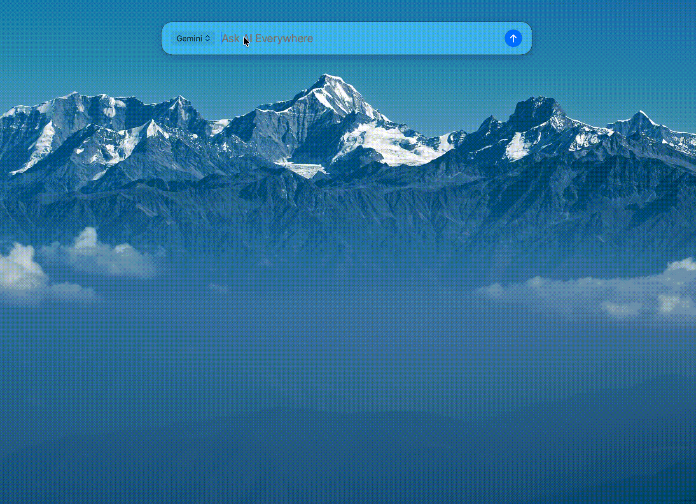
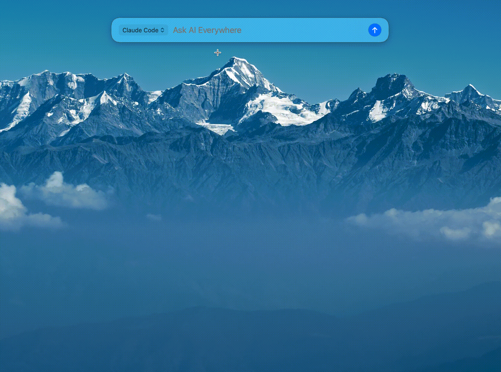

  

<h1 align="center">GroAsk</h1>

  <strong>One hotkey to every AI. No tab switching. No setup.</strong> 
  Press ⌥Space to reach ChatGPT, Claude, Gemini, DeepSeek, and 13 more AIs — including CLI agents like Claude Code.

  
  
  
  

  

---

## Why GroAsk?

You already pay for ChatGPT, Claude, Gemini... but switching between browser tabs is slow. GroAsk lives in your menu bar — press **⌥Space**, pick an AI, type your question, done. No API keys needed. It uses your existing web subscriptions directly.

| | GroAsk | ChatGPT/Claude App | Raycast AI | BoltAI |
|---|---|---|---|---|
| AI Channels | **17** (11 Web + 6 CLI) | 1 | 1 | Multi (needs API Key) |
| Pricing | **$9.99 one-time** | Free | $8/month | $37-57 |
| API Key Required | No | No | No | **Yes** |
| Uses Official Website | **Yes** (full features) | N/A | Custom UI | Custom UI |
| Claude Code Support | **Yes** | No | No | No |
| Native Swift | **Yes** (8 MB) | Electron | Electron | Swift |

## Demo

### Web AI — Select text, send to any AI

  

### CLI Agents — Claude Code, Gemini CLI, Codex and more

  

## Features

| Feature | Description |
|---------|-------------|
| **Global Hotkey** | `⌥Space` launches GroAsk from anywhere (customizable to `⌥G`) |
| **17 AI Channels** | 11 Web AI + 6 CLI agents, switch with `Tab` |
| **Select & Ask** | Select any text → press hotkey → it's already in the launcher |
| **Image Support** | Paste or drag & drop images into Web AI channels |
| **CLI Agents** | Claude Code, Gemini CLI, Codex, CodeBuddy, Kimi Code, Qwen Code |
| **Silent Mode** | `⌥Enter` auto-submits without opening the AI window |
| **No API Keys** | Uses your existing web subscriptions — zero setup |
| **Lightweight** | Native Swift, 8 MB, launches in under 1 second |

## Supported Channels

### Web AI (Free)

| Channel | |  Channel | | Channel |
|---------|---|---------|---|---------|
| ChatGPT | | Perplexity | | Doubao (豆包) |
| Claude | | Grok | | Copilot |
| Gemini | | DeepSeek | | Qwen |
| Kimi | | | | ChatGLM |

### CLI Agents (Pro)

| Channel | | Channel | | Channel |
|---------|---|---------|---|---------|
| Claude Code | | Codex | | Kimi Code |
| Gemini CLI | | CodeBuddy | | Qwen Code |

## Install

1. **Download** [GroAsk.dmg](https://github.com/ThinkerJack/groask-release/releases/latest/download/GroAsk.dmg)
2. Open the DMG and drag **GroAsk** to Applications
3. Launch GroAsk — it appears in your menu bar as a bolt icon
4. Press **⌥Space** and start asking

> First launch: if macOS blocks the app, go to **System Settings → Privacy & Security** and click "Open Anyway".

## Pricing

| | Free | Pro ($9.99) |
|---|------|-------------|
| Web AI channels | All 11 channels | All 11 channels |
| CLI agents | — | All 6 agents |
| Select & Ask | ✓ | ✓ |
| Image support | ✓ | ✓ |
| Silent mode | ✓ | ✓ |

One-time purchase. Lifetime license. All future updates included.

## System Requirements

- macOS 13.0 (Ventura) or later
- Google Chrome
- For CLI agents: Node.js and the respective CLI tool installed

## Links

- **Website**: [groask.com](https://groask.com)
- **Releases**: [All versions](https://github.com/ThinkerJack/groask-release/releases)
- **Issues**: [Report a bug](https://github.com/ThinkerJack/groask-release/issues)
- **Contact**: contact@groask.com

---

## 中文说明

**GroAsk** 是一个 macOS 菜单栏 AI 启动器。按下 `⌥Space`，即可快速访问 ChatGPT、Claude、Gemini、DeepSeek 等 17 个 AI，无需 API Key，直接使用你已有的网页版账号。快捷键可在设置中自定义为 `⌥G`。

### 核心功能

- **全局热键** `⌥Space` 随时唤起（可自定义为 `⌥G`）
- **17 个 AI 通道** — 11 个 Web AI + 6 个 CLI 通道，`Tab` 键快速切换
- **选中即问** — 选中任意文字，按快捷键直接发送到 AI
- **图片支持** — 拖拽或粘贴图片到 Web AI
- **CLI 通道** — Claude Code / Gemini CLI / Codex / CodeBuddy / Kimi Code / Qwen Code
- **静默模式** — `⌥Enter` 自动提交，无需打开 AI 窗口
- **原生 Swift** — 8 MB，秒启动，无 Electron

### Web AI 通道（免费）

ChatGPT、Claude、Gemini、Perplexity、Grok、DeepSeek、Kimi、豆包、Copilot、Qwen、ChatGLM

### CLI 通道（Pro）

Claude Code、Gemini CLI、Codex、CodeBuddy、Kimi Code、Qwen Code

### 安装

1. 下载 [GroAsk.dmg](https://github.com/ThinkerJack/groask-release/releases/latest/download/GroAsk.dmg)
2. 打开 DMG，拖入 Applications
3. 首次打开如遇安全提示 → 系统设置 → 隐私与安全性 → 允许运行

### 定价

- **免费版**：全部 11 个 Web AI 通道
- **Pro 版 ($9.99 / ¥68)**：+ 6 个 CLI 通道 — 一次购买，终身使用
