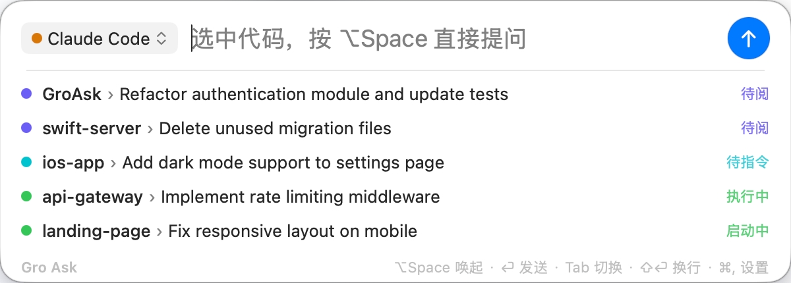

  

<h1 align="center">GroAsk</h1>

  <strong>The AI Command Center for macOS.</strong> 
  Native Claude Code workbench with real-time agent monitoring. 
  Launch, track, and manage all your AI agents from the menu bar.

  
  
  
  

  

---

## Why GroAsk?

You run multiple Claude Code sessions across different projects. Which one needs approval? Which one is waiting for input? GroAsk gives you a **native macOS workbench** with real-time agent monitoring — see every session's status at a glance, click to jump straight to the terminal.

Plus, press **⌥Space** to launch Claude Code, Gemini CLI, Codex, and 4 web AIs from one unified interface. Pure AppKit, < 0.3s launch, < 50MB memory. No API keys needed.

## Demo

### Real-Time Agent Monitoring — Native Claude Code experience

  

### CLI Agents — Claude Code, Gemini CLI, Codex and more

  

### Web AI — Select text, send to any AI

  

## Features

| Feature | Description |
|---------|-------------|
| **Real-Time Agent Monitoring** | Native Claude Code task tracking — see every session's status, one-click jump to terminal |
| **Global Hotkey** | `⌥Space` launches GroAsk from anywhere (customizable) |
| **Native macOS** | Pure AppKit, 2 MB, < 0.3s launch, < 50MB memory |
| **10 AI Channels** | 6 CLI agents + 4 Web AIs, switch with `Tab` |
| **Workspace Shortcuts** | Launch Claude Code across multiple project directories |
| **Multi-Terminal** | Terminal, iTerm2, Ghostty, Warp |
| **Select & Ask** | Select any text → press hotkey → it's already in the AI |
| **Image Support** | `⌘V` to paste screenshots and ask AI |
| **Silent Mode** | `⌥Enter` sends to AI in the background |
| **No API Keys** | Uses your existing CLI tools and web sessions — zero config |

## Supported Channels

### CLI Agents

| Channel | Channel | Channel |
|---------|---------|---------|
| Claude Code | Codex | Kimi Code |
| Gemini CLI | CodeBuddy | Qwen Code |

### Web AI

| Channel | Channel |
|---------|---------|
| ChatGPT | Gemini |
| Claude | Monica |

## Install

1. **Download** [GroAsk.dmg](https://groask.com/download?ref=github)
2. Open the DMG and drag **GroAsk** to Applications
3. Launch GroAsk — it appears in your menu bar
4. Press **⌥Space** and start asking

## Privacy

- Runs 100% locally — no data collected or stored
- Accessibility permission used only for text capture and image paste
- No API keys required — uses your existing CLI tools and AI web sessions

## System Requirements

- macOS 13.0 (Ventura) or later
- Google Chrome (for web AI channels only)
- For CLI agents: the respective CLI tool installed (e.g. `curl -fsSL https://claude.ai/install.sh | bash`)

## Links

- **Website**: [groask.com](https://groask.com)
- **Releases**: [All versions](https://github.com/ThinkerJack/groask-release/releases)
- **Issues**: [Report a bug](https://github.com/ThinkerJack/groask-release/issues)
- **Discussions**: [Community](https://github.com/ThinkerJack/groask-release/discussions)

---

## 中文说明

**GroAsk** 是 macOS 的 AI 调度中心。原生 Claude Code 工作台，实时监控每个 Agent 任务状态——待审批、待输入、执行中，一键跳转终端。

按下 `⌥Space`，即可启动 Claude Code、Gemini CLI、Codex 等 6 个 CLI Agent 和 4 个 Web AI。纯原生 AppKit，秒启动，无需 API Key。

### 核心功能

- **实时 Agent 监控** — 原生 Claude Code 任务追踪，一键跳转终端
- **全局热键** `⌥Space` 随时唤起（可自定义）
- **原生 macOS 体验** — 纯 AppKit，2 MB，启动 < 0.3 秒，内存 < 50 MB
- **10 个 AI 通道** — 6 个 CLI Agent + 4 个 Web AI，`Tab` 键快速切换
- **工作区快捷方式** — 快速切换多个项目目录启动 Claude Code
- **多终端支持** — Terminal、iTerm2、Ghostty、Warp
- **划词即问** — 选中文本，按快捷键，自动发给 AI
- **图片支持** — `⌘V` 粘贴截图提问
- **静默模式** — `⌥Enter` 后台发送任务

### CLI Agent

Claude Code、Gemini CLI、Codex、CodeBuddy、Kimi Code、Qwen Code

### Web AI 通道

ChatGPT、Claude、Gemini、Monica

### 安装

1. 下载 [GroAsk.dmg](https://groask.com/download?ref=github)
2. 打开 DMG，拖入 Applications

### 定价

**完全免费** — 所有功能开放，无试用期，无需升级。
